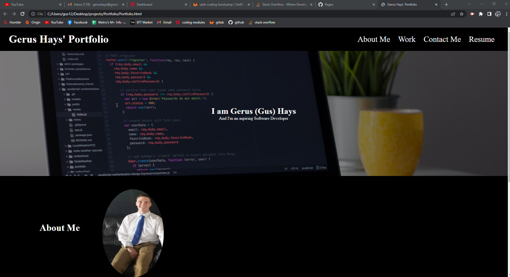

# My-Portfolio
## Purpose
The purpose of this webpage is to show-off the work I have done thus far. As well as building a template for future projects.  
I of course plan to add to this portfolio and make it look even better as my experience with coding increases and I am very excited to go down that path!  
Throughout the portfolio I ensured that the header would stay fixed so the user may navigate throughout the webpage no matter how far they scroll down.  
I did decide to include my resume. However, it is diplaying my current job position due to the fact I have no coding experience yet or I don't feel like i have anything quantifiable enough to put on a resume pertaining to software.  
I ensured the webpage is responsive. It did look ok in most layouts on phones and tablets so my media queries were minimal. 
Whenever the user selects an image they are taken to the deployed webpage so that they may view the webpage or code in its entirety. For now there is a placeholder taking the user to google until I complete more work.  
Thank you for checking out my webpage!

## Built With
* HTML
* CSS

## Hi there 👋 I'm Gus!

### I'm:
- 🏢 Currently a UAS Standardization Instructor Pilot at [General Atomics](https://www.ga.com/)
- 🏫 Currently attending University of Utah's Full Stack Software Development Bootcamp
- 🎖️ A eight year U.S. Army veteran where I piloted this [aircraft](https://www.ga-asi.com/remotely-piloted-aircraft/gray-eagle)

### In my free time you can find me:
- 🏍️ Having fun on 2 wheels
- 🥾 Exploring the world
- 🎮 Playing videogames

### My links:
- 📧 Get in touch via [email](mailto:gerushays@gmail.com)
- 🔗 Connect with me on [LinkedIn](https://www.linkedin.com/in/gerushays/)
- My [website](https://gerushays.github.io/My-Portfolio/)

### Some languages, technologies, and tools I use:

  
  
  
  
  
  
  

## Screenshot

## Contribution
Made with ❤️ by Gerus Hays
